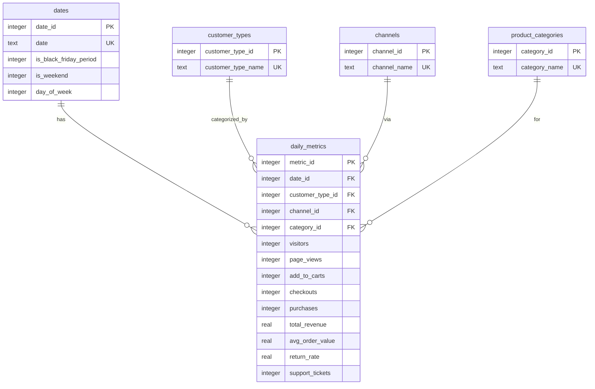

# E-commerce Analytics Database Schema

*Documentation generated by AI assistant based on SQLite schema analysis*

## 1. Database Overview

**Purpose:** Track daily e-commerce performance metrics across multiple business dimensions for analytical reporting and insights.

**Scope:** 
- Time period: November 1, 2024 to December 15, 2024 (45 days)
- Business dimensions: Sales channels, customer types, product categories
- Metrics: Full conversion funnel from visitors to revenue

**Design Pattern:** Star schema with one fact table (`daily_metrics`) and four dimension tables.

## 2. Schema Diagram



## 3. Dimension Tables

### 3.1 dates
Calendar dimension with business context flags.

| Column Name | Data Type | Constraints | Description | Example Values |
|-------------|-----------|-------------|-------------|----------------|
| date_id | INTEGER | PRIMARY KEY | Surrogate key for date dimension | 1, 2, 3 |
| date | TEXT | NOT NULL, UNIQUE | Calendar date in ISO format (YYYY-MM-DD) | "2024-11-01" |
| is_black_friday_period | INTEGER | NOT NULL | Boolean flag for Black Friday period (0=False, 1=True) | 0, 1 |
| is_weekend | INTEGER | NOT NULL | Boolean flag for weekend days (0=False, 1=True) | 0, 1 |
| day_of_week | INTEGER | NOT NULL | Numeric day of week (0=Sunday, ..., 6=Saturday) | 4 (Thursday) |

**Cardinality:** 45 rows (one per day in date range)

### 3.2 customer_types
Customer segmentation dimension.

| Column Name | Data Type | Constraints | Description | Example Values |
|-------------|-----------|-------------|-------------|----------------|
| customer_type_id | INTEGER | PRIMARY KEY | Surrogate key for customer type | 1, 2 |
| customer_type_name | TEXT | NOT NULL, UNIQUE | Descriptive customer type label | "New", "Returning" |

**Cardinality:** 2 rows

### 3.3 channels
Marketing and sales channels dimension.

| Column Name | Data Type | Constraints | Description | Example Values |
|-------------|-----------|-------------|-------------|----------------|
| channel_id | INTEGER | PRIMARY KEY | Surrogate key for channel | 1, 2 |
| channel_name | TEXT | NOT NULL, UNIQUE | Channel name | "Direct", "Email" |

**Cardinality:** 2 rows

### 3.4 product_categories
Product classification dimension.

| Column Name | Data Type | Constraints | Description | Example Values |
|-------------|-----------|-------------|-------------|----------------|
| category_id | INTEGER | PRIMARY KEY | Surrogate key for product category | 1, 2 |
| category_name | TEXT | NOT NULL, UNIQUE | Product category name | "Electronics", "Home Goods" |

**Cardinality:** 2 rows

## 4. Fact Table

### 4.1 daily_metrics
Core fact table containing daily aggregated metrics across all dimension combinations.

| Column Name | Data Type | Constraints | Description | Measurement Unit |
|-------------|-----------|-------------|-------------|------------------|
| metric_id | INTEGER | PRIMARY KEY | Surrogate key for metric record | - |
| date_id | INTEGER | FOREIGN KEY (dates.date_id) | Date dimension reference | - |
| customer_type_id | INTEGER | FOREIGN KEY (customer_types.customer_type_id) | Customer type dimension reference | - |
| channel_id | INTEGER | FOREIGN KEY (channels.channel_id) | Channel dimension reference | - |
| category_id | INTEGER | FOREIGN KEY (product_categories.category_id) | Product category dimension reference | - |
| visitors | INTEGER | NOT NULL | Unique visitors to the site | Count |
| page_views | INTEGER | NOT NULL | Total page views | Count |
| add_to_carts | INTEGER | NOT NULL | Add-to-cart actions | Count |
| checkouts | INTEGER | NOT NULL | Checkout process initiations | Count |
| purchases | INTEGER | NOT NULL | Completed purchases | Count |
| total_revenue | REAL | NOT NULL | Total sales revenue | Monetary (e.g., USD) |
| avg_order_value | REAL | NOT NULL | Average revenue per order | Monetary (e.g., USD) |
| return_rate | REAL | NOT NULL | Percentage of returned items | Percentage (0.0-100.0) |
| support_tickets | INTEGER | NOT NULL | Customer support tickets opened | Count |

**Foreign Key Constraints:**
- `date_id` → `dates.date_id`
- `customer_type_id` → `customer_types.customer_type_id`
- `channel_id` → `channels.channel_id`
- `category_id` → `product_categories.category_id`

**Cardinality:** 360 rows (45 days × 2 channels × 2 customer types × 2 categories)

## 5. Business Metrics Hierarchy

The database supports analysis of the complete e-commerce conversion funnel:

### 5.1 Acquisition & Awareness
- **Visitors:** Top-of-funnel traffic
- **Page Views:** Engagement depth indicator

### 5.2 Consideration & Intent
- **Add-to-Carts:** Product consideration metric
- **Checkouts:** Purchase intent signal

### 5.3 Conversion & Revenue
- **Purchases:** Completed transactions
- **Total Revenue:** Gross sales value
- **Average Order Value:** Transaction size metric

### 5.4 Retention & Service
- **Return Rate:** Product quality/satisfaction indicator
- **Support Tickets:** Customer service workload

## 6. Data Statistics

| Dimension | Values | Total Combinations |
|-----------|--------|-------------------|
| Dates | 45 days (2024-11-01 to 2024-12-15) | - |
| Channels | Direct, Email | 2 |
| Customer Types | New, Returning | 2 |
| Product Categories | Electronics, Home Goods | 2 |
| **Total Fact Records** | - | **360** |

**Granularity:** Daily metrics per channel, customer type, and product category combination.

## 7. Example Analytical Queries

### 7.1 Daily Revenue Trend
```sql
SELECT 
    d.date,
    SUM(dm.total_revenue) AS daily_revenue,
    SUM(dm.purchases) AS total_purchases
FROM daily_metrics dm
JOIN dates d ON dm.date_id = d.date_id
GROUP BY d.date
ORDER BY d.date;
```

### 7.2 Channel Performance Comparison
```sql
SELECT 
    c.channel_name,
    SUM(dm.visitors) AS total_visitors,
    SUM(dm.purchases) AS total_purchases,
    SUM(dm.total_revenue) AS total_revenue,
    AVG(dm.avg_order_value) AS avg_aov
FROM daily_metrics dm
JOIN channels c ON dm.channel_id = c.channel_id
GROUP BY c.channel_name;
```

### 7.3 Conversion Funnel Analysis
```sql
SELECT 
    ct.customer_type_name,
    SUM(dm.visitors) AS visitors,
    SUM(dm.add_to_carts) AS add_to_carts,
    SUM(dm.checkouts) AS checkouts,
    SUM(dm.purchases) AS purchases,
    ROUND(100.0 * SUM(dm.purchases) / SUM(dm.visitors), 2) AS conversion_rate
FROM daily_metrics dm
JOIN customer_types ct ON dm.customer_type_id = ct.customer_type_id
GROUP BY ct.customer_type_name;
```

## 8. Schema Creation SQL

The database was created with the following schema (extracted from `.schema`):

```sql
CREATE TABLE channels (
    channel_id INTEGER PRIMARY KEY,
    channel_name TEXT NOT NULL UNIQUE
);

CREATE TABLE customer_types (
    customer_type_id INTEGER PRIMARY KEY,
    customer_type_name TEXT NOT NULL UNIQUE
);

CREATE TABLE daily_metrics (
    metric_id INTEGER PRIMARY KEY,
    date_id INTEGER NOT NULL,
    customer_type_id INTEGER NOT NULL,
    channel_id INTEGER NOT NULL,
    category_id INTEGER NOT NULL,
    visitors INTEGER NOT NULL,
    page_views INTEGER NOT NULL,
    add_to_carts INTEGER NOT NULL,
    checkouts INTEGER NOT NULL,
    purchases INTEGER NOT NULL,
    total_revenue REAL NOT NULL,
    avg_order_value REAL NOT NULL,
    return_rate REAL NOT NULL,
    support_tickets INTEGER NOT NULL,
    FOREIGN KEY (date_id) REFERENCES dates (date_id),
    FOREIGN KEY (customer_type_id) REFERENCES customer_types (customer_type_id),
    FOREIGN KEY (channel_id) REFERENCES channels (channel_id),
    FOREIGN KEY (category_id) REFERENCES product_categories (category_id)
);

CREATE TABLE dates (
    date_id INTEGER PRIMARY KEY,
    date TEXT NOT NULL UNIQUE,
    is_black_friday_period INTEGER NOT NULL,
    is_weekend INTEGER NOT NULL,
    day_of_week INTEGER NOT NULL
);

CREATE TABLE product_categories (
    category_id INTEGER PRIMARY KEY,
    category_name TEXT NOT NULL UNIQUE
);
```

---

*Documentation last updated: February 15, 2026*  
*Source database: ecommerce_data.db*  
*Analysis method: SQLite schema introspection and data sampling*